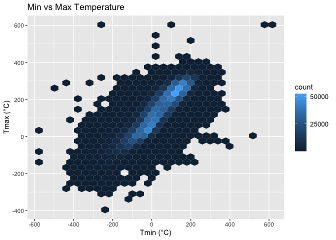
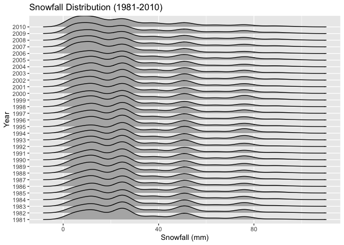

P8105 Homework 3
================
October 15, 2024

## Problem 1

Load NY NOAA data from p8105.datasets package

``` r
data("ny_noaa")
```

``` r
station_count <- ny_noaa |> 
  distinct(id) |> 
  nrow()

first_year <- ny_noaa |> 
  pull(date) |> 
  min() |> 
  year()

last_year <- ny_noaa |> 
  pull(date) |> 
  max() |> 
  year()
```

This dataset contains 2595176 rows and 7 columns. The variables include
station ID, observation date, precipitation (in tenths of mm), snowfall
(in mm), snow depth (in mm), and minimum/maximum temperatures (in tenths
of degrees Celsius). Data spans from 1981 to 2010, covering 747 weather
stations.

``` r
ny_noaa_prepped <- ny_noaa |> 
  separate(date, into = c("year", "month", "day"), convert = TRUE) |> 
  mutate(tmin = as.numeric(tmin), 
         tmax = as.numeric(tmax))

snowfall_counts <- ny_noaa_prepped |> 
  count(snow) |> 
  arrange(desc(n))

most_frequent_snowfall <- snowfall_counts |> 
  slice(1) |> 
  pull(snow)

second_frequent_snowfall <- snowfall_counts |> 
  slice(2) |> 
  pull(snow)
```

In cleaning the data, we split the `date` into `year`, `month`, and
`day` components and converted `tmin` and `tmax` into numeric values.
The most common snowfall value is 0 mm, likely reflecting the fact that
snow doesn’t frequently occur in New York. The second most common value,
NA, likely represents missing data.

``` r
ny_noaa_prepped |> 
  filter(month %in% c(1, 7)) |> 
  mutate(month = recode(month, `1` = "January", `7` = "July")) |> 
  group_by(id, year, month) |> 
  summarize(mean_tmax = mean(tmax, na.rm = TRUE)) |>
  ungroup() |> 
  ggplot(aes(x = year, y = mean_tmax, group = id)) +
  geom_point() +
  geom_line() +
  facet_wrap(~month) +
  labs(title = "Average Maximum Temperature in January and July by Station", 
       y = "Max Temperature (°C)") +
  theme(legend.position = "none")
```

    ## Warning: Removed 5970 rows containing missing values or values outside the scale range
    ## (`geom_point()`).

    ## Warning: Removed 5640 rows containing missing values or values outside the scale range
    ## (`geom_line()`).

<!-- -->
The two-panel plot above shows the average maximum temperature for
January and July across different weather stations over the years. As
generally expected, July temperatures are consistently higher than
January between 1981 and 2010. The year 1988 stands out with an
unusually cold July, and January also shows some colder anomalies in
1982, 1993, and 2005.

``` r
hex_plot <- ny_noaa_prepped |> 
  ggplot(aes(x = tmin, y = tmax)) + 
  geom_hex() +
  scale_x_continuous(breaks = seq(-600, 600, 200)) +
  scale_y_continuous(breaks = seq(-400, 600, 200)) +
  scale_fill_continuous(breaks = c(0, 25000, 50000)) +
  labs(title = "Min vs Max Temperature", x = "Tmin (°C)", y = "Tmax (°C)") +
  theme(legend.text = element_text(size = 10))

ridge_plot <- ny_noaa_prepped |> 
  filter(snow < 100, snow > 0) |> 
  ggplot(aes(x = snow, y = as.factor(year))) + 
  geom_density_ridges() +
  labs(title = "Snowfall Distribution (1981-2010)", x = "Snowfall (mm)", y = "Year")

hex_plot
```

    ## Warning: Removed 1136276 rows containing non-finite outside the scale range
    ## (`stat_binhex()`).

<!-- -->

``` r
ridge_plot
```

<!-- -->
The figures above presents a two-part visualization: a hex plot
depicting the relationship between minimum and maximum temperatures, and
a ridge plot showing the yearly snowfall distribution. In the hex plot,
most data points cluster near the center, where tmin closely aligns with
tmax. This suggests temperature variations on the same day were
generally small. The ridge plot shows that most stations reported annual
snowfall between 0 and 35 mm, with additional peaks at around 50 mm and
80 mm, likely due to unit conversions from inches to millimeters.
