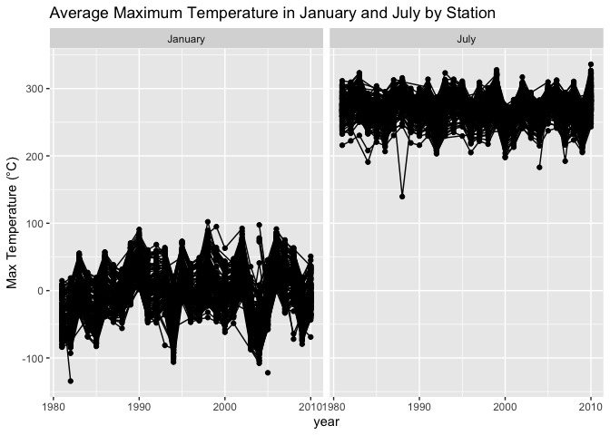

P8105 Homework 3
================
October 15, 2024

## Problem 1

Load NY NOAA data from p8105.datasets package

``` r
data("ny_noaa")
```

``` r
station_count <- ny_noaa |> 
  distinct(id) |> 
  nrow()

first_year <- ny_noaa |> 
  pull(date) |> 
  min() |> 
  year()

last_year <- ny_noaa |> 
  pull(date) |> 
  max() |> 
  year()
```

This dataset contains 2595176 rows and 7 columns. The variables include
station ID, observation date, precipitation (in tenths of mm), snowfall
(in mm), snow depth (in mm), and minimum/maximum temperatures (in tenths
of degrees Celsius). Data spans from 1981 to 2010, covering 747 weather
stations.

``` r
ny_noaa_prepped <- ny_noaa |> 
  separate(date, into = c("year", "month", "day"), convert = TRUE) |> 
  mutate(tmin = as.numeric(tmin), 
         tmax = as.numeric(tmax))

snowfall_counts <- ny_noaa_prepped |> 
  count(snow) |> 
  arrange(desc(n))

most_frequent_snowfall <- snowfall_counts |> 
  slice(1) |> 
  pull(snow)

second_frequent_snowfall <- snowfall_counts |> 
  slice(2) |> 
  pull(snow)
```

In cleaning the data, we split the `date` into `year`, `month`, and
`day` components and converted `tmin` and `tmax` into numeric values.
The most common snowfall value is 0 mm, likely reflecting the fact that
snow doesn’t frequently occur in New York. The second most common value,
NA, likely represents missing data.

``` r
ny_noaa_prepped |> 
  filter(month %in% c(1, 7)) |> 
  mutate(month = recode(month, `1` = "January", `7` = "July")) |> 
  group_by(id, year, month) |> 
  summarize(mean_tmax = mean(tmax, na.rm = TRUE)) |>
  ungroup() |> 
  ggplot(aes(x = year, y = mean_tmax, group = id)) +
  geom_point() +
  geom_line() +
  facet_wrap(~month) +
  labs(title = "Average Maximum Temperature in January and July by Station", 
       y = "Max Temperature (°C)") +
  theme(legend.position = "none")
```

    ## Warning: Removed 5970 rows containing missing values or values outside the scale range
    ## (`geom_point()`).

    ## Warning: Removed 5640 rows containing missing values or values outside the scale range
    ## (`geom_line()`).

<!-- -->
The two-panel plot above shows the average maximum temperature for
January and July across different weather stations over the years. As
generally expected, July temperatures are consistently higher than
January between 1981 and 2010. The year 1988 stands out with an
unusually cold July, and January also shows some colder anomalies in
1982, 1993, and 2005.

``` r
hex_plot <- ny_noaa_prepped |> 
  ggplot(aes(x = tmin, y = tmax)) + 
  geom_hex() +
  scale_x_continuous(breaks = seq(-600, 600, 200)) +
  scale_y_continuous(breaks = seq(-400, 600, 200)) +
  scale_fill_continuous(breaks = c(0, 25000, 50000)) +
  labs(title = "Min vs Max Temperature", x = "Tmin (°C)", y = "Tmax (°C)") +
  theme(legend.text = element_text(size = 10))

ridge_plot <- ny_noaa_prepped |> 
  filter(snow < 100, snow > 0) |> 
  ggplot(aes(x = snow, y = as.factor(year))) + 
  geom_density_ridges() +
  labs(title = "Snowfall Distribution (1981-2010)", x = "Snowfall (mm)", y = "Year")

hex_plot
```

    ## Warning: Removed 1136276 rows containing non-finite outside the scale range
    ## (`stat_binhex()`).

<!-- -->

``` r
ridge_plot
```

<!-- -->
The figures above presents a two-part visualization: a hex plot
depicting the relationship between minimum and maximum temperatures, and
a ridge plot showing the yearly snowfall distribution. In the hex plot,
most data points cluster near the center, where tmin closely aligns with
tmax. This suggests temperature variations on the same day were
generally small. The ridge plot shows that most stations reported annual
snowfall between 0 and 35 mm, with additional peaks at around 50 mm and
80 mm, likely due to unit conversions from inches to millimeters.

## Problem 2

Load the datasets

``` r
demo_data <- read_csv("data/nhanes_covar.csv", skip = 4) %>%
  clean_names()

accel_data <- read_csv("data/nhanes_accel.csv") %>%
  clean_names() %>%
  pivot_longer(cols = starts_with("min"), names_to = "minute", values_to = "mims", names_prefix = "min") %>%
  mutate(minute = as.numeric(minute))
```

Merge and Filter demo and accel data

``` r
combined_data <- demo_data %>%
  inner_join(accel_data, by = "seqn") %>%
  drop_na(sex, age, education) %>%
  filter(age > 20) %>%
  mutate(sex = recode(sex, `1` = "Male", `2` = "Female"),
         education = recode(education,
                            `1` = "Less than high school",
                            `2` = "High school diploma",
                            `3` = "Some college or more"),
         education = factor(education, levels = c("Less than high school", "High school diploma", "Some college or more")))
```

Summarize by sex and education

``` r
summary_table <- combined_data %>%
  group_by(sex, education) %>%
  summarize(total_minutes = n(),
            avg_bmi = round(mean(bmi, na.rm = TRUE), 2),
            avg_mims = round(mean(mims, na.rm = TRUE), 2)) %>%
  knitr::kable()

summary_table
```

| sex    | education             | total_minutes | avg_bmi | avg_mims |
|:-------|:----------------------|--------------:|--------:|---------:|
| Female | Less than high school |         41760 |   31.18 |     8.83 |
| Female | High school diploma   |         33120 |   31.71 |     8.72 |
| Female | Some college or more  |         84960 |   28.75 |     9.59 |
| Male   | Less than high school |         40320 |   28.30 |     9.23 |
| Male   | High school diploma   |         51840 |   29.05 |     8.04 |
| Male   | Some college or more  |         80640 |   29.02 |     8.36 |

The table illustrates that there is a range of 33,120 to 84,960 average
movement (MIMS) readings across both genders in each education group.
Participants with a higher level of education tend to have the most
MIMS, while participants with less than high school education tend to
have the least MIMS. Femles in the “Some college or more” group exhibit
the highest average MIMS. Conversely, women with a high school level or
less of education are less active overall. Also, higher MIMS values are
associated with lower average BMI in both men and women.

### Plot age distributions by gender and education

``` r
ggplot(combined_data, aes(x = age, fill = sex)) +
  geom_density(alpha = 0.4) +
  facet_wrap(~education, scales = "free_y") +
  labs(title = "Age Distribution by Gender and Education Level",
       x = "Age", y = "Density") +
  scale_fill_manual(values = c("Male" = "blue", "Female" = "pink")) +
  theme_minimal()
```

<!-- -->
The density plots suggest distinct age distributions between genders
across education levels. Women with less education tend to be older,
while men have a more even distribution. Those with higher education are
younger on average, especially among females, who show a high density of
participants in their 20s and 30s. This reflects possible socioeconomic
and generational patterns in education attainment and longevity.

Calculate total daily activity for each participant

``` r
total_activity_data <- combined_data %>%
  group_by(seqn, age, sex, education) %>%
  summarize(daily_activity = sum(mims, na.rm = TRUE), .groups = "drop")
```

### Plot total daily activity against age

``` r
ggplot(total_activity_data, aes(x = age, y = daily_activity, color = sex)) +
  geom_point(alpha = 0.4) +
  geom_smooth(method = "loess", se = FALSE) +
  facet_grid(~education) +
  labs(title = "Total Daily Activity vs Age by Gender and Education Level",
       x = "Age", y = "Total Daily Activity (MIMS)",
       color = "Gender") +
  theme_minimal()
```

<!-- -->
After creating this plot to compare men and women daily activity across
education levels, I observe that physical activity tends to decrease
with age for both genders, but the decline varies significantly based on
education level. People with higher education seem to maintain more
consistent activity levels across their lifespan, but ultimately see a
decline in later years similar to less educated groups. Women,
especially in the “some college or more” category, generally tend to
have higher activity levels in younger and middle-aged years compared to
men of similar education.For individuals with less than high school
education, both men and women exhibit a more significant and early
decline in physical activity, particularly around age 40 and beyond.

Group by minute count and calculate average activity per minute

``` r
activity_by_minute <- combined_data %>%
  group_by(seqn, age, sex, education, minute) %>%
  summarize(avg_mims = mean(mims, na.rm = TRUE), .groups = "drop")
```

### Plot the activity time course over 24 hours

``` r
ggplot(activity_by_minute, aes(x = minute, y = avg_mims, color = sex)) +
  geom_smooth(method = "gam", se = FALSE) +
  facet_wrap(~education, ncol = 1) +
  labs(title = "24-Hour Activity Time Course by Education and Gender",
       x = "Minute of the Day", y = "Average MIMS Activity",
       color = "Gender") +
  scale_x_continuous(breaks = seq(0, 1440, by = 240), labels = seq(0, 24, by = 4)) +
  theme_minimal()
```

<!-- -->
Overall, the plot shows that daily activity patterns are quite similar
across gender and educational levels, but individuals with more
education tend to have more consistent and sustained activity throughout
the day. Women generally show slightly higher activity levels than men,
particularly during the morning and afternoon hours, though the
differences are relatively small. The timing of peak activity (around
noon) and the subsequent decline is a common pattern across all groups,
likely reflecting typical waking and sleeping schedules.

## Problem 3

Import and Clean the Citi Bike Data:

``` r
bike_data_files <- list.files("data/citibike")
month_names <- c("2020-Jan", "2024-Jan", "2020-July", "2024-July")

monthly_citibike_data <- lapply(1:4, function(i){
  print(month_names[i])
  data <- read_csv(paste0("data/citibike/", bike_data_files[i])) |> 
    mutate(period = month_names[i],
           bike_type = factor(rideable_type),
           day = factor(weekdays, levels = c("Monday", "Tuesday", "Wednesday", "Thursday", 
                                             "Friday", "Saturday", "Sunday")),
           user_type = factor(member_casual)) |>
    separate(period, into = c("year", "month"), sep = "-") |> 
    mutate(year = as.integer(year))
  return(data)
})
```

    ## [1] "2020-Jan"
    ## [1] "2024-Jan"
    ## [1] "2020-July"
    ## [1] "2024-July"

``` r
names(monthly_citibike_data) <- month_names
```

The above code reads in the Citi Bike ride data, covering January and
July of 2020 and 2024. For each dataset, columns representing the ride
type, day of the week, and user type (member or casual) are converted to
categorical variables. The datasets also have the ride’s duration,
starting and ending station, among other details. After adding the month
and year information, the datasets have varying numbers of rows, each
representing individual rides.

Combine the data

``` r
all_citibike_data <- bind_rows(monthly_citibike_data)
```

### Create Summary Table of Total Rides by Year, Month, and User Type:

``` r
all_citibike_data |> 
  group_by(user_type, year, month) |> 
  summarise(total_rides = n()) |> 
  arrange(year, month, user_type) |> 
  rename(user_status = user_type) |> 
  knitr::kable()
```

| user_status | year | month | total_rides |
|:------------|-----:|:------|------------:|
| casual      | 2020 | Jan   |         984 |
| member      | 2020 | Jan   |       11436 |
| casual      | 2020 | July  |        5637 |
| member      | 2020 | July  |       15411 |
| casual      | 2024 | Jan   |        2108 |
| member      | 2024 | Jan   |       16753 |
| casual      | 2024 | July  |       10894 |
| member      | 2024 | July  |       36262 |

Here, we can see a summary the number of rides by year, month, and user
type (members vs. casual riders). The results show that members tend to
account for a greater number of rides than casual users, possibly due to
frequent commuting and making use of the membership. Moreover, the total
number of rides for both user types has risen from 2020 to 2024.

### Popular Starting Stations for July 2024:

``` r
top_stations <- all_citibike_data |> 
  filter(year == 2024, month == "July") |>
  group_by(start_station_name) |> 
  summarise(total_rides = n()) |> 
  arrange(desc(total_rides)) |>
  slice(1:5)

top_stations |> 
  knitr::kable()
```

| start_station_name       | total_rides |
|:-------------------------|------------:|
| Pier 61 at Chelsea Piers |         163 |
| University Pl & E 14 St  |         155 |
| W 21 St & 6 Ave          |         152 |
| West St & Chambers St    |         150 |
| W 31 St & 7 Ave          |         146 |

``` r
popular_stations <- pull(top_stations, start_station_name)
totaled_rides <- pull(top_stations, total_rides)[1]
```

This section identifies the five most popular starting stations for July
2024, listing them in descending order of total rides. The most popular
station is Pier 61 at Chelsea Piers with 163 rides. The next most
popular stations are University Pl & E 14 St, W 21 St & 6 Ave, West St &
Chambers St. Lastly, the least most popular station is W 31 St & 7 Ave
with 146 rides.

### Analyze the Effect of Day, Month, and Year on Median Ride Duration:

``` r
all_citibike_data |> 
  group_by(year, month, day) |> 
  summarise(median_duration = median(duration, na.rm = TRUE)) |> 
  ggplot(aes(x = day, y = median_duration, fill = month)) +
  geom_bar(stat = "identity", position = position_dodge()) +
  facet_wrap(~year, ncol = 1) +
  labs(title = "Effects of day of the week, month, and year on median ride duration",
       x = "Day of the Week",
       y = "Median Duration (min)",
       fill = "Month")
```

<!-- -->
July has higher ride durations due to better weather, promoting more
recreational biking, while January typically shows shorter rides.
Weekends (Saturday, Sunday) see longer rides, likely due to recreational
use, while weekdays show shorter durations, possibly reflecting
commuting patterns. Ride durations in 2024 are generally shorter than in
2020, especially in July, suggesting potential changes in rider
behavior, bike usage, or external factors like covid or availability of
electric bikes.

### Ride Duration Distribution by Bike Type, Month, and User Type in 2024:

``` r
all_citibike_data |> 
  filter(year == 2024) |>
  ggplot(aes(x = user_type, y = duration, fill = user_type)) +
  geom_violin(alpha = 0.5) +
  facet_wrap(~ month + bike_type) +
  labs(
    title = "Ride Duration Distribution by User Type, Month, and Bike Type (2024)",
    x = "User Type",
    y = "Ride Duration (minutes)",
    fill = "User Type"
  ) +
  theme_minimal()
```

<!-- -->
Casual users have a higher variability in ride durations across all bike
types and months, especially for electric bikes.Members exhibit more
consistent, shorter ride durations, particularly for classic bikes.
Seasonality (comparing January to July) plays a significant role in the
spread of durations, with July showing more extended rides, particularly
for casual users.
